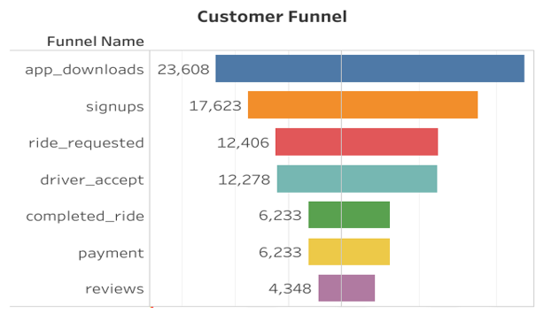
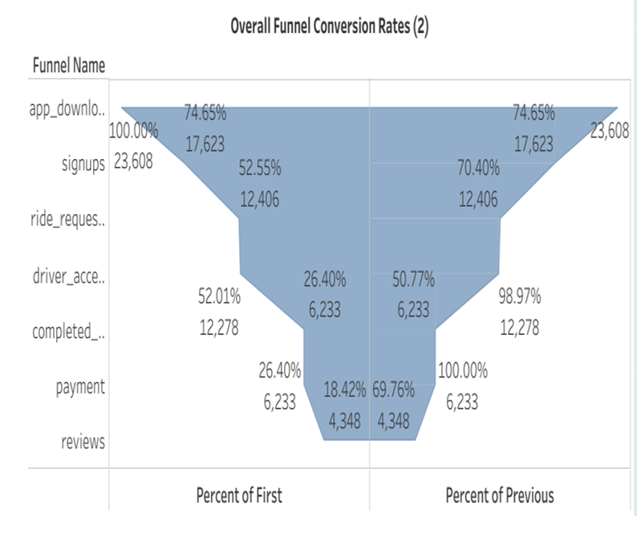
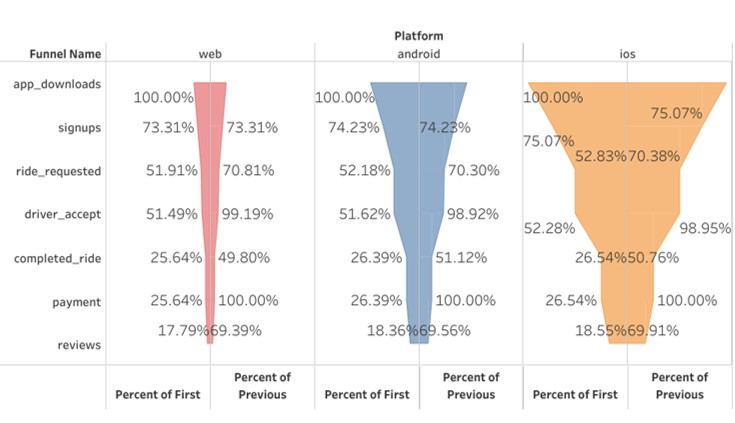
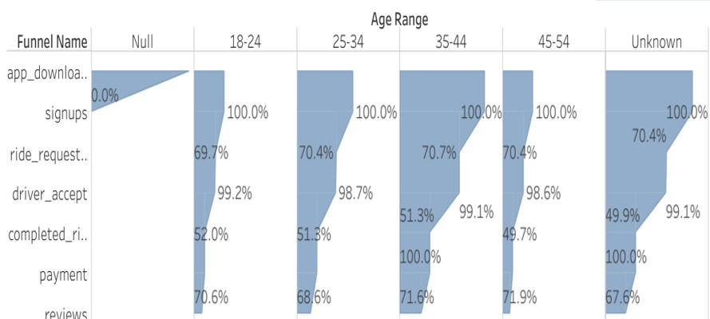
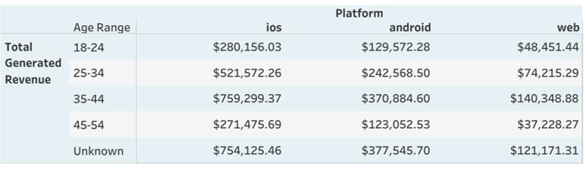
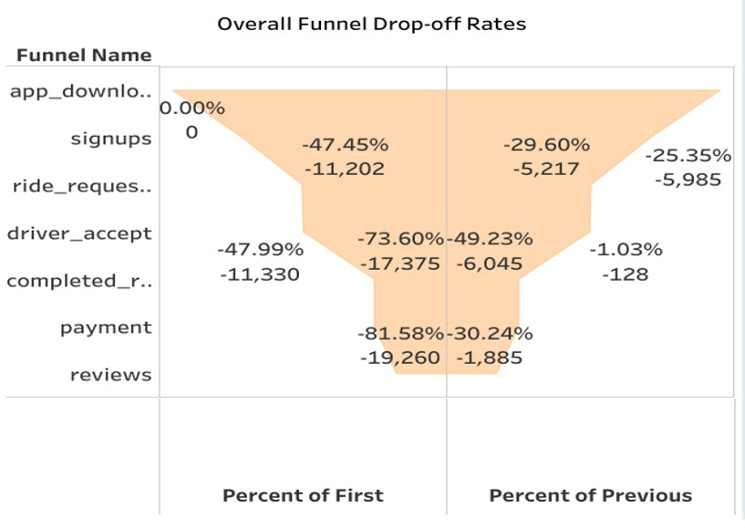
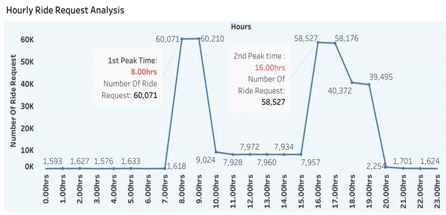
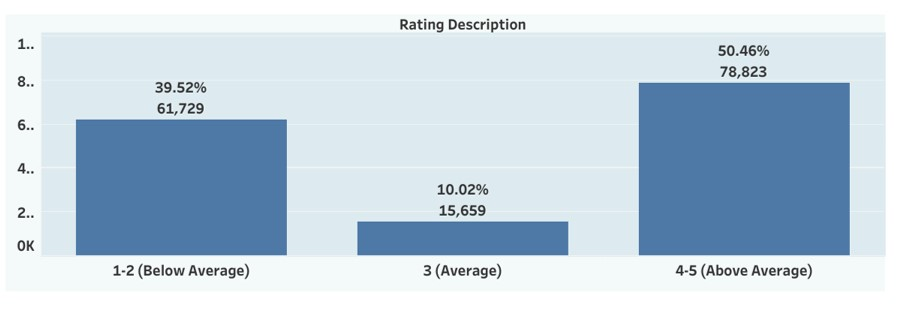

# MetroCar-Funnel-Analysis

## About Metrocar:
Metro car operates within the ride-sharing industry by connecting passengers with drivers through its mobile app
Using the customer funnel analysis we would explore the journey of all our customers(users) who downloaded the app in 2021.
## Analysis Goal:
Understand the customer funnel and identify areas for improvement and optimization
## Data : 
App downloads(downloads)  from the year 2021(23.6k)and download stream signups + rides through April  2022

## Overall Conversion Rates
- A significant amount (74.6%) of app downloads result in signups
- Similarly, 70.4 % of signed-up users end up requesting a ride
- Overall, 52% of app downloads result in ride_request

## Conversion Rates Across Platforms
- Relatively similar conversion rates for the platforms across the funnel
- However, the IOS platform has the highest volume of users based on the wide  funnel chart area

## Conversion Rates Across Age Range
- Excluding the  Null and Unknown values, the 35-44 age group accounts for the majority of users while the 45-54 makes up the least.
- Also conversion rates are relatively similar throughout the funnel for all age ranges

## Revenue Generated Across Platforms and Age range
- The  known age range  of users within 35-44 years using the IOS platform generates the highest revenue
- The least revenue is generated by the 45-54 age range of web users

## Overall Drop-off Rates
- About half of the users from driver-accept did not proceed to completed rides(-49.23%) drop-off

## Hourly Ride Request 
- Ride requests throughout the day depict 1st peak period between 8 am and 10 am  and the next peak period in the evening(16:00 - 20:00)hrs
  
## Rating segmentation
- 50.56% rated their experience with the metro car app as above average(4-5)while 39.2% rated the app as either 1 or 2
  

